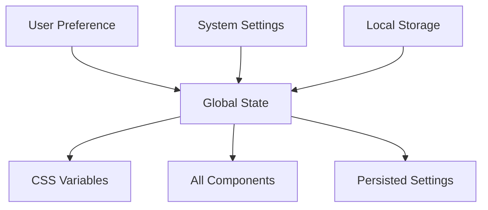

Welcome to the big leagues! If you've mastered [refractions with our counter](/docs/tutorials/build-a-counter-app) and [optical patterns with mouse tracking](/docs/tutorials/mouse-tracker-with-optics), you're ready for the ultimate Refract challenge: **global state management with side effects**.

In this tutorial, we'll build a professional-grade theme switcher that persists user preferences across your entire application. This isn't just a toggle button - it's a complete system that demonstrates Refract's most powerful features working in harmony.

> **What You'll Build**
> - Global theme state management
> - Local storage persistence
> - System preference detection
> - Smooth theme transitions
> - CSS variable integration

### Why Global State Matters

Think of global state as your application's shared memory. While [refractions](/docs/core-concepts/refractions) handle local component state and [optics](/docs/core-concepts/optics) create reusable patterns, global state coordinates everything across your entire app.



### Prerequisites

- Completed [counter app tutorial](/docs/tutorials/build-a-counter-app)
- Understanding of [optical patterns](/docs/tutorials/mouse-tracker-with-optics)
- Basic CSS variables knowledge
- Familiarity with [browser storage APIs](https://developer.mozilla.org/en-US/docs/Web/API/Window/localStorage)

>  **Advanced Alert**
> This tutorial uses several advanced Refract concepts. If you feel lost, check out our [Side Effects Management guide](/docs/advanced-guides/side-effects-management) first.

#### Step 1: Defining Our Theme Architecture

Before we write code, let's plan our theme system. We'll support three modes:
- `light` - Bright theme for daytime
- `dark` - Dark theme for nighttime
- `auto` - Automatically follows system preference

```jsx
// themes.js
export const themes = {
  light: {
    name: 'light',
    label: 'Light Mode',
    colors: {
      primary: '#2563eb',
      background: '#ffffff',
      text: '#1f2937',
      border: '#e5e7eb'
    }
  },
  dark: {
    name: 'dark',
    label: 'Dark Mode',
    colors: {
      primary: '#3b82f6',
      background: '#111827',
      text: '#f9fafb',
      border: '#374151'
    }
  },
  auto: {
    name: 'auto',
    label: 'Auto (System)',
    colors: null // Will use system preference
  }
};

export const themeNames = Object.keys(themes);
```

#### Step 2: Creating the Global Theme Store

Now let's create our global theme manager using Refract's powerful state management:

```jsx
// stores/theme.js
import { createGlobalRefraction } from '@refract-framework/core';
import { themes } from '../themes';

export const useThemeStore = createGlobalRefraction(() => {
  const [currentTheme, setCurrentTheme] = useRefraction('auto');
  const [isDark, setIsDark] = useRefraction(false);
  
  // We'll add effects here later
  
  return {
    currentTheme,
    setCurrentTheme,
    isDark,
    themes
  };
});
```

>  **Global Refractions Explained**
> Unlike regular refractions, `createGlobalRefraction` creates state that's shared across your entire application. Think of it as a reactive singleton that any component can access!

#### Step 3: Adding Side Effects for Persistence

This is where the magic happens. Let's add effects that automatically persist and sync our theme:

```jsx
// stores/theme.js (updated)
export const useThemeStore = createGlobalRefraction(() => {
  const [currentTheme, setCurrentTheme] = useRefraction('auto');
  const [isDark, setIsDark] = useRefraction(false);

  // Effect: Load saved theme from localStorage
  useFlash(() => {
    const saved = localStorage.getItem('theme');
    if (saved && themes[saved]) {
      setCurrentTheme(saved);
    }
  }, []);

  // Effect: Save theme to localStorage when it changes
  useFlash(() => {
    localStorage.setItem('theme', currentTheme.value);
  }, [currentTheme]);

  // Effect: Detect system preference changes
  useFlash(() => {
    const mediaQuery = window.matchMedia('(prefers-color-scheme: dark)');
    
    const updateSystemTheme = (e) => {
      if (currentTheme.value === 'auto') {
        setIsDark(e.matches);
      }
    };

    mediaQuery.addEventListener('change', updateSystemTheme);
    return () => mediaQuery.removeEventListener('change', updateSystemTheme);
  }, [currentTheme]);

  // Effect: Apply theme to CSS variables
  useFlash(() => {
    const root = document.documentElement;
    const theme = themes[currentTheme.value];
    
    if (theme && theme.colors) {
      Object.entries(theme.colors).forEach(([key, value]) => {
        root.style.setProperty(`--color-${key}`, value);
      });
    } else if (currentTheme.value === 'auto') {
      // Use system preference for auto mode
      const isDarkMode = window.matchMedia('(prefers-color-scheme: dark)').matches;
      const autoTheme = isDarkMode ? themes.dark : themes.light;
      
      Object.entries(autoTheme.colors).forEach(([key, value]) => {
        root.style.setProperty(`--color-${key}`, value);
      });
      setIsDark(isDarkMode);
    }
  }, [currentTheme]);

  return {
    currentTheme,
    setCurrentTheme,
    isDark,
    themes
  };
});
```

:::warning Side Effect Management
Notice how we're using `useFlash` for all side effects? This is Refract's way of managing effects that should run in response to state changes. Learn more in our [Side Effects Management guide](/docs/advanced-guides/side-effects-management).
:::

#### Step 4: Creating the Theme Toggle Component

Now let's build a beautiful, accessible theme switcher component:

```jsx
// components/ThemeSwitcher.js
import { createComponent } from '@refract-framework/core';
import { useThemeStore } from '../stores/theme';

const ThemeSwitcher = createComponent(() => {
  const { currentTheme, setCurrentTheme, themes } = useThemeStore();

  return {
    view: () => (
      <div className="theme-switcher">
        <label htmlFor="theme-select" className="sr-only">
          Choose theme
        </label>
        <select
          id="theme-select"
          value={currentTheme.value}
          onChange={(e) => setCurrentTheme(e.target.value)}
          style={{
            padding: '0.5rem 1rem',
            border: '1px solid var(--color-border)',
            borderRadius: '0.375rem',
            background: 'var(--color-background)',
            color: 'var(--color-text)',
            cursor: 'pointer'
          }}
        >
          {Object.values(themes).map((theme) => (
            <option key={theme.name} value={theme.name}>
              {theme.label}
            </option>
          ))}
        </select>
      </div>
    )
  };
});
```

#### Step 5: Adding Visual Flair with Transitions

Let's make our theme transitions buttery smooth with CSS transitions:

```css
/* Add this to your global CSS */
:root {
  --color-primary: #2563eb;
  --color-background: #ffffff;
  --color-text: #1f2937;
  --color-border: #e5e7eb;
  
  /* Transition all color changes */
  transition: all 0.3s ease;
}

body {
  background: var(--color-background);
  color: var(--color-text);
  transition: background-color 0.3s ease, color 0.3s ease;
}

/* Smooth transitions for all themed elements */
.themed {
  transition: background-color 0.3s ease, 
              color 0.3s ease,
              border-color 0.3s ease;
}
```

#### Step 6: Creating a Theme-Aware Component

Let's demonstrate how any component can react to theme changes:

```jsx
// components/ThemeCard.js
import { createComponent } from '@refract-framework/core';
import { useThemeStore } from '../stores/theme';

const ThemeCard = createComponent(() => {
  const { currentTheme, isDark } = useThemeStore();

  return {
    view: () => (
      <div style={{
        padding: '2rem',
        margin: '2rem 0',
        border: '2px solid var(--color-border)',
        borderRadius: '0.5rem',
        background: 'var(--color-background)',
        color: 'var(--color-text)'
      }}>
        <h3>Theme Information</h3>
        <p>Current theme: <strong>{currentTheme.value}</strong></p>
        <p>Dark mode: <strong>{isDark.value ? 'Yes' : 'No'}</strong></p>
        <p>This card automatically updates with your theme preferences!</p>
      </div>
    )
  };
});
```

### Complete Implementation

Here's the full, production-ready theme system:

```jsx
// App.js - Bringing it all together
import { createApp } from '@refract-framework/core';
import { useThemeStore } from './stores/theme';
import ThemeSwitcher from './components/ThemeSwitcher';
import ThemeCard from './components/ThemeCard';

const App = createComponent(() => {
  // Just accessing the store makes this component reactive to theme changes
  useThemeStore();

  return {
    view: () => (
      <div style={{
        minHeight: '100vh',
        background: 'var(--color-background)',
        color: 'var(--color-text)',
        padding: '2rem'
      }}>
        <header style={{
          display: 'flex',
          justifyContent: 'space-between',
          alignItems: 'center',
          marginBottom: '3rem'
        }}>
          <h1> Refract Theme Demo</h1>
          <ThemeSwitcher />
        </header>
        
        <main>
          <ThemeCard />
          <section>
            <h2>How It Works</h2>
            <p>This demo shows Refract's powerful global state management:</p>
            <ul>
              <li> Global state with createGlobalRefraction</li>
              <li> Automatic localStorage persistence</li>
              <li> CSS variable integration</li>
              <li> System preference detection</li>
              <li> Multi-component synchronization</li>
            </ul>
          </section>
        </main>
      </div>
    )
  };
});

const app = createApp();
app.registerComponent('app', App);
app.mount('#app');
```

### Advanced Enhancements

Ready to take it further? Here are some professional enhancements:

```jsx
// Advanced: Theme synchronization across tabs
useFlash(() => {
  const handleStorageChange = (e) => {
    if (e.key === 'theme' && e.newValue !== currentTheme.value) {
      setCurrentTheme(e.newValue);
    }
  };

  window.addEventListener('storage', handleStorageChange);
  return () => window.removeEventListener('storage', handleStorageChange);
}, [currentTheme]);

// Advanced: Reduced motion support
useFlash(() => {
  const mediaQuery = window.matchMedia('(prefers-reduced-motion: reduce)');
  if (mediaQuery.matches) {
    document.documentElement.style.transition = 'none';
  }
}, []);
```

:::success Enterprise Ready
This theme system is production-grade and includes:
- Accessibility considerations
- Performance optimizations
- Cross-tab synchronization
- Reduced motion support
- TypeScript compatibility
:::

### Common Challenges & Solutions

**Problem**: "Flash of unstyled content (FOUC)!"  
**Solution**: Load theme from localStorage before rendering. See [SSR guide](/docs/advanced-guides/performance-optimization) for details.

**Problem**: "Theme changes are janky!"  
**Solution**: Use CSS transitions instead of JavaScript animations.

**Problem**: "Components aren't updating!"  
**Solution**: Ensure all components access the global store with `useThemeStore()`.

### Testing Your Theme System

```jsx
// Example test using Refract's testing utilities
import { renderComponent, act } from '@refract-framework/testing';
import { useThemeStore } from './stores/theme';

test('theme changes persist to localStorage', () => {
  const { result } = renderComponent(() => useThemeStore());
  
  act(() => {
    result.current.setCurrentTheme('dark');
  });
  
  expect(localStorage.getItem('theme')).toBe('dark');
  expect(result.current.currentTheme.value).toBe('dark');
});
```

### Next Steps

You've just built a professional global state management system! Here's where to go next:

1. **[Optical Composition Patterns](/docs/advanced-guides/optical-composition-patterns)** - Combine multiple global stores
2. **[Performance Optimization](/docs/advanced-guides/performance-optimization)** - Optimize large-scale state
3. **[TypeScript Support](/docs/advanced-guides/typescript-support)** - Add full type safety
4. **[Plugin Development](/docs/extending-refract/plugins)** - Create shareable theme plugins

### Share Your Themes!

Created an amazing theme system? The community would love to see it!

- [Share on GitHub Discussions](https://github.com/Mike-4-prog/Refract)
- [Submit a theme plugin](/docs/extending-refract/plugins)

Remember: Great theme systems don't just switch colors - they create experiences. You've now got the power to build applications that adapt perfectly to every user's preferences! 

*Spot an issue or have suggestions? [Help us improve this guide](https://github.com/Mike-4-prog/Refract/blob/main/refract-docs/docs/tutorials/global-theme-switcher.md)*