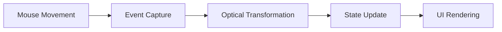

### 🖱️ Build a Mouse Tracker with Optics

Welcome to your second Refract adventure! If you've completed our [counter app tutorial](/docs/tutorials/build-a-counter-app), you're ready to level up. Today, we're building a real-time mouse position tracker that demonstrates the power of **optics** - Refract's secret weapon for reusable reactive logic.

> 🎯 **What You'll Build**
> - A live mouse position tracker
> - Reusable optical patterns
> - Smooth coordinate updates
> - Clean, maintainable event handling

### Why Optics Matter

Think of optics like super-powered lenses for your state. While [refractions](/docs/core-concepts/refractions) handle basic reactivity, optics let you create **reusable behavior patterns** that can be composed together. It's like moving from basic arithmetic to algebra!



### Prerequisites

- Completed [counter app tutorial](/docs/tutorials/build-a-counter-app)
- Understanding of [basic refractions](/docs/core-concepts/refractions)
- Familiarity with JavaScript events

> 📚 **New to Optics?**
> No worries! Check out our [Core Concepts guide](/docs/core-concepts/optics) for a gentle introduction before diving in.

#### 1.  Setting Up the Foundation

First, let's create our basic component structure. We'll start with a simple refraction to hold our mouse coordinates:

```jsx
import { createComponent, useRefraction } from '@refract-framework/core';

const MouseTracker = createComponent(() => {
  const [position, setPosition] = useRefraction({ x: 0, y: 0 });

  return {
    view: () => (
      <div className="tracker-container">
        <p>Move your mouse around!</p>
        <p>Position: ({position.value.x}, {position.value.y})</p>
      </div>
    )
  };
});
```

This gives us a basic structure, but it's not tracking anything yet. Let's change that!

#### 2. Creating Our First Optical Pattern

Here's where optics shine. Instead of wiring up event listeners manually, we'll create a reusable `useMousePosition` optical pattern:

```jsx
const useMousePosition = () => {
  const [position, setPosition] = useRefraction({ x: 0, y: 0 });

  const updatePosition = (event) => {
    setPosition({ x: event.clientX, y: event.clientY });
  };

  return {
    position,
    handlers: {
      onMouseMove: updatePosition
    }
  };
};
```

> 💡 **Optical Insight**
> Notice how we're returning both the state (`position`) and the behavior (`handlers`). This separation is what makes optics so powerful - they encapsulate both data and logic!

#### 3. Integrating the Optical Pattern

Now let's use our shiny new optical pattern in our component:

```jsx
const MouseTracker = createComponent(() => {
  const { position, handlers } = useMousePosition();

  return {
    view: () => (
      <div 
        className="tracker-container" 
        style={{ height: '100vh', background: 'var(--ifm-color-emphasis-100)' }}
        {...handlers}
      >
        <div style={{
          position: 'fixed',
          top: '2rem',
          left: '2rem',
          background: 'var(--ifm-background-surface-color)',
          padding: '1rem',
          border: '1px solid var(--ifm-color-emphasis-200)',
          borderRadius: '8px'
        }}>
          <h3>Mouse Position</h3>
          <p>X: {position.value.x}px</p>
          <p>Y: {position.value.y}px</p>
        </div>
      </div>
    )
  };
});
```

:::note Performance Consideration
Mouse events fire very frequently! In a production app, you might want to add [debouncing patterns](/docs/advanced-guides/performance-optimization) to optimize performance.
:::

#### 4.  Adding Visual Feedback

Let's make this more engaging with a visual tracker that follows your cursor:

```jsx
return {
  view: () => (
    <div className="tracker-container" {...handlers}>
      {/* Position display */}
      <div className="position-display">
        <h3>🎯 Live Tracker</h3>
        <p>X: {position.value.x}px</p>
        <p>Y: {position.value.y}px</p>
      </div>
      
      {/* Visual tracker */}
      <div style={{
        position: 'fixed',
        left: position.value.x - 15,
        top: position.value.y - 15,
        width: '30px',
        height: '30px',
        background: 'var(--ifm-color-primary)',
        borderRadius: '50%',
        pointerEvents: 'none',
        transition: 'transform 0.1s ease',
        transform: `scale(${position.value.moving ? 1.2 : 1})`
      }} />
    </div>
  )
};
```

#### 5. Enhancing with Advanced Optics

Let's extract our optical pattern to make it truly reusable across your entire application:

```jsx
// optical-patterns/mouse.js
export const useMousePosition = (options = {}) => {
  const [position, setPosition] = useRefraction({ 
    x: 0, 
    y: 0,
    moving: false
  });

  let moveTimeout;
  
  const updatePosition = (event) => {
    setPosition({ 
      x: event.clientX, 
      y: event.clientY,
      moving: true
    });
    
    clearTimeout(moveTimeout);
    moveTimeout = setTimeout(() => {
      setPosition(prev => ({ ...prev, moving: false }));
    }, 100);
  };

  return {
    position,
    handlers: {
      onMouseMove: updatePosition
    }
  };
};
```

> 🚀 **Optical Composition**
> This pattern can now be easily composed with other optics. Imagine combining mouse position with [gesture detection](/docs/extending-refract/plugins) or [animation frameworks](/docs/advanced-guides/optical-composition-patterns)!

#### Complete Implementation

Here's the full, production-ready mouse tracker:

```jsx
import { createComponent, useRefraction } from '@refract-framework/core';
import { useMousePosition } from '../optical-patterns/mouse';

const MouseTracker = createComponent(() => {
  const { position, handlers } = useMousePosition();

  return {
    view: () => (
      <div 
        style={{ 
          height: '100vh', 
          background: 'var(--ifm-color-emphasis-100)',
          position: 'relative',
          overflow: 'hidden'
        }}
        {...handlers}
      >
        {/* Position Display */}
        <div style={{
          position: 'fixed',
          top: '2rem',
          left: '2rem',
          background: 'var(--ifm-background-surface-color)',
          padding: '1.5rem',
          border: '1px solid var(--ifm-color-emphasis-200)',
          borderRadius: '12px',
          boxShadow: 'var(--ifm-global-shadow-md)',
          zIndex: 10
        }}>
          <h3 style={{ margin: '0 0 1rem 0' }}>🎯 Live Mouse Tracker</h3>
          <div style={{ display: 'grid', gridTemplateColumns: '1fr 1fr', gap: '1rem' }}>
            <div>
              <strong>X Position</strong>
              <p>{position.value.x}px</p>
            </div>
            <div>
              <strong>Y Position</strong>
              <p>{position.value.y}px</p>
            </div>
          </div>
        </div>

        {/* Visual Tracker */}
        <div style={{
          position: 'fixed',
          left: position.value.x - 20,
          top: position.value.y - 20,
          width: '40px',
          height: '40px',
          background: 'var(--ifm-color-primary)',
          borderRadius: '50%',
          pointerEvents: 'none',
          transition: 'all 0.15s ease',
          transform: `scale(${position.value.moving ? 1.1 : 0.8})`,
          opacity: position.value.moving ? 1 : 0.7
        }} />
      </div>
    )
  };
});

export default MouseTracker;
```

#### Going Beyond: Optical Patterns in Practice

What you've just created isn't just a mouse tracker - it's a **reusable optical pattern** that can be used throughout your application:

```jsx
// Need mouse position in multiple components?
const { position } = useMousePosition();

// Combine with other optics!
const { position: mousePos } = useMousePosition();
const { scroll: scrollPos } = useScrollPosition();
const combined = useOpticalComposition(mousePos, scrollPos);
```

:::tip Real-World Usage
Optical patterns like this are perfect for:
- Custom cursors
- Drag-and-drop interfaces
- Interactive canvases
- Gesture-based controls
- Parallax effects
:::

### Common Challenges & Solutions

**Problem**: "My tracker is janky at high speeds!"  
**Solution**: Implement [requestAnimationFrame](/docs/advanced-guides/performance-optimization) for smoother updates.

**Problem**: "I need to track multiple elements!"  
**Solution**: Modify the optical pattern to accept a [DOM reference](/docs/api-reference/reactivity-api) parameter.

**Problem**: "I want to add touch support!"  
**Solution**: Extend the handlers to include [touch events](/docs/extending-refract/plugins).

### Next Steps

Ready to level up again? Here's where to go next:

1. **[Global Theme Switcher](/docs/tutorials/global-theme-switcher)** - Learn effects and global state
2. **[Optical Composition Patterns](/docs/advanced-guides/optical-composition-patterns)** - Combine multiple optics
3. **[Performance Optimization](/docs/advanced-guides/performance-optimization)** - Smooth 60fps animations

### Share Your Creation!

Built something amazing with optical patterns? Share it with our community! 

- [Join our Discord](https://discord.gg/refract)
- [Share on GitHub Discussions](https://github.com/your-org/refract/discussions)
- [Submit a plugin](/docs/extending-refract/plugins)

Remember: Every complex application is built from simple optical patterns. You've just added a powerful tool to your Refract toolkit! 🛠️

*Found an issue? [Help us improve this guide](https://github.com/your-org/refract/edit/main/docs/tutorials/mouse-tracker-with-optics.md)*